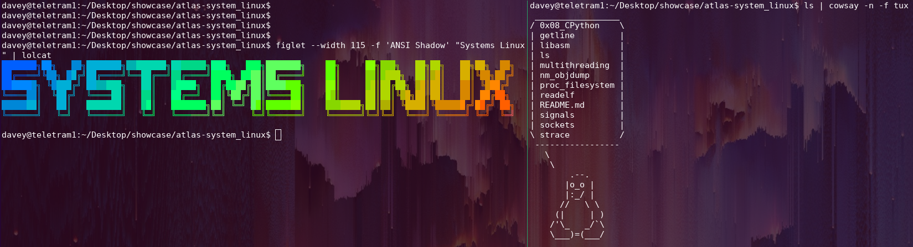

# System Linux

## Description

This repo contains all our systems linux projects as part of ATLAS school's LAB program. Our goal was to learn how these tools work under the hood by implementing them ourselves, givng us a deeper understanding of how the linux environment works and how the operating system interacts with the kernal under the hood. Additionally we learned x86 assembly and multithreading to further enhance our undestanding of how software and hardware interact.

## Table of Contents

| Module           | Description                                              |
| ---------------- | -------------------------------------------------------- |
| CPython          | Writing Python modules in C                              |
| Getline          | implementation of getline function in stdlib             |
| LS               | implementation of ls                                     |
| Signals          | manipulating signals                                     |
| Readelf          | implementation of readelf, reads ELF files               |
| NM               | implementation of nm, reads symbol tables                |
| Strace           | implementation of strace, reads syscalls of process      |
| Multithreading   | manipulating the threads.h abi                           |
| Libasm           | our x86 assembly project re-writing common c funcs       |
| Sockets          | our berkley sockets implementation of an http 1.0 server |

## How to read these projects

Each project has its own README.md containing the project data as provided by ATLAS, including the relevant data structure definitions, how to compile, and sample files to test output against.

